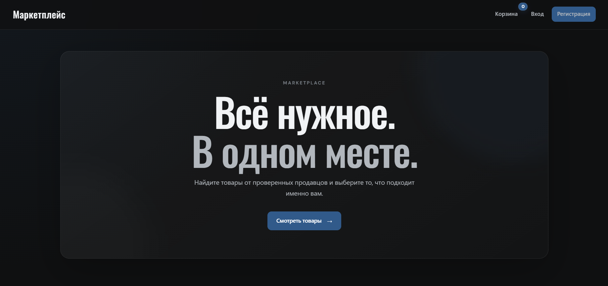
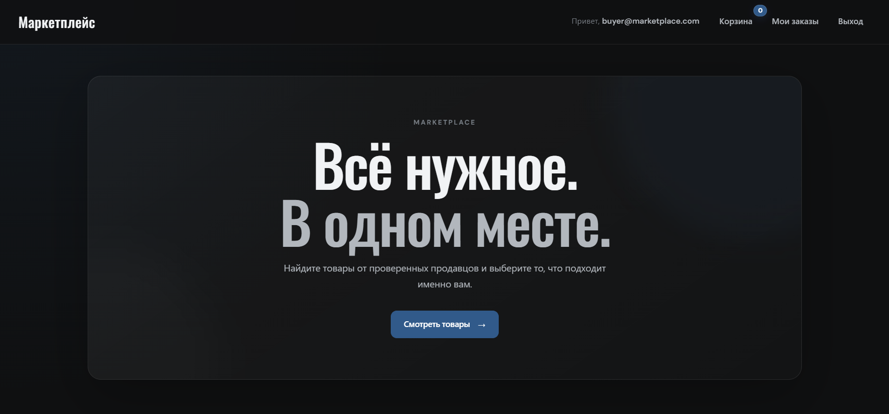
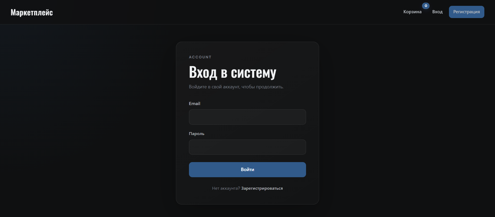
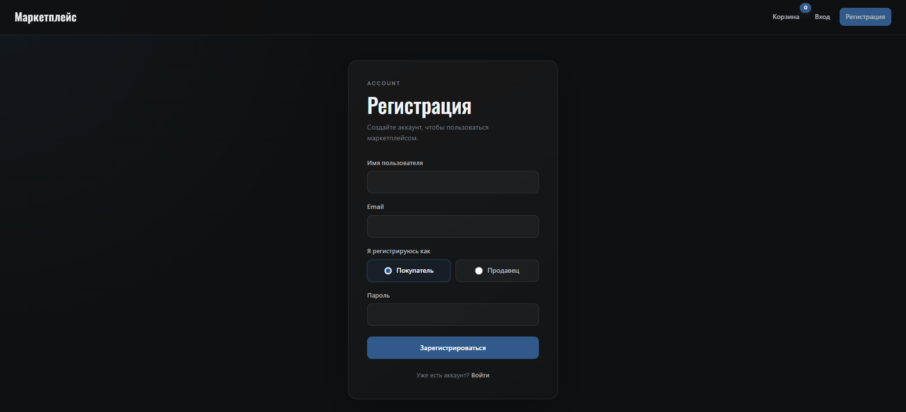
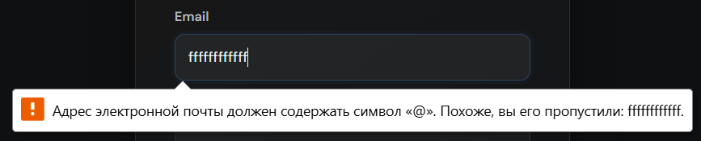
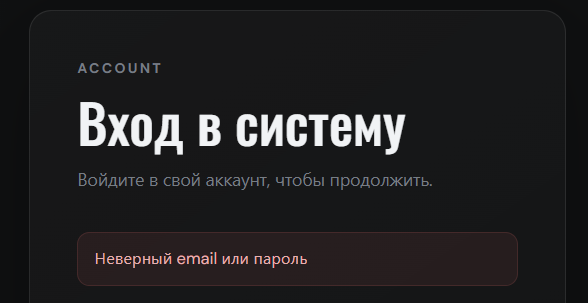
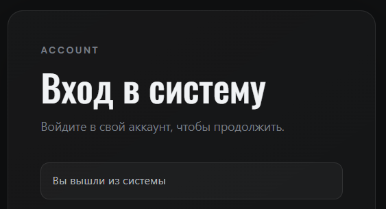

# 📸 Демонстрация работы Marketplace

Прогулка по функционалу приложения — от главной страницы до оформления заказа.

> 🔗 **Код проекта:** [github.com/LanaRaw/marketplace](https://github.com/LanaRaw/marketplace)

## Оглавление

1. [Введение](#1-введение)
2. [Главная страница](#2-главная-страница)
3. [Регистрация и вход](#3-регистрация-и-вход)
4. [Роли пользователей](#4-роли-пользователей)
5. [Витрина товаров](#5-витрина-товаров)
6. [Карточка товара](#6-карточка-товара)
7. [Корзина](#7-корзина)
8. [Оформление заказа](#8-оформление-заказа)
9. [История заказов](#9-история-заказов)
10. [Страницы ошибок](#10-страницы-ошибок)
11. [Планы и ссылки](#11-планы-и-ссылки)

---

## 1. Введение

**Marketplace** — пет-проект веб-приложения маркетплейса на Spring Boot. Реализует базовые сценарии электронной коммерции: регистрацию с ролями, витрину товаров, корзину и оформление заказов.

**Стек:** Java 17, Spring Boot, Spring Security, PostgreSQL, Thymeleaf, Bootstrap 5.

Ниже — пошаговая демонстрация всех функций с скриншотами.

---

## 2. Главная страница

Главная страница — точка входа для покупателя. Здесь отображаются последние добавленные товары, а шапка меняется в зависимости от того, авторизован пользователь или нет.

### 2.1 Неавторизованный пользователь

В шапке — кнопки **«Войти»** и **«Регистрация»**, а также ссылка на **корзину**. Пользователь может просматривать товары и складывать их в корзину, но для оформления заказа потребуется войти.

*Рис. 1. Главная страница для неавторизованного пользователя*

### 2.2 Авторизованный пользователь

После входа в шапке дополнительно появляется раздел **«Мои заказы»** — доступ к истории покупок. Корзина остаётся доступной в обоих состояниях.

*Рис. 2. Главная страница для авторизованного пользователя*

### 2.3 Список товаров

Ниже — сетка последних добавленных товаров. Каждая карточка содержит изображение, название, краткое описание, цену и две кнопки: **«Подробнее»** (переход на детальную страницу) и **«В корзину»** (быстрое добавление товара).

*Рис. 3. Сетка последних товаров с кнопками «Подробнее» и «В корзину»*

---

## 3. Регистрация и вход

### 3.1 Вход в систему

Для входа достаточно ввести **email** и **пароль**. Если аккаунта ещё нет — внизу формы есть ссылка на регистрацию.

*Рис. 4. Форма входа в систему*

### 3.2 Регистрация

При регистрации пользователь указывает **имя**, **email** и **пароль**, а также выбирает роль: **Покупатель** или **Продавец**. Администратор в этом списке отсутствует — эта роль выдаётся отдельно.

*Рис. 5. Форма регистрации с выбором роли*

### 3.3 Валидация

Формы проверяют введённые данные. Например, email должен содержать символ `@` — иначе появится подсказка.

*Рис. 6. Подсказка при некорректном email*

Если при входе указан неверный email или пароль — выводится соответствующее сообщение.

*Рис. 7. Сообщение о неверном email или пароле*

### 3.4 Выход из аккаунта

После выхода пользователь возвращается в неавторизованное состояние — в шапке снова появляются кнопки **«Войти»** и **«Регистрация»**.

*Рис. 8. Подтверждение выхода из аккаунта*
