# 📸 Демонстрация работы Marketplace

Прогулка по функционалу приложения — от главной страницы до оформления заказа.

> 🔗 **Код проекта:** [github.com/LanaRaw/marketplace](https://github.com/LanaRaw/marketplace)

## Оглавление

1. [Введение](#1-введение)
2. [Главная страница](#2-главная-страница)
3. [Регистрация и вход](#3-регистрация-и-вход)
4. [Витрина товаров](#4-витрина-товаров)
5. [Карточка товара](#5-карточка-товара)
6. [Корзина](#6-корзина)
7. [Оформление заказа](#7-оформление-заказа)
8. [История заказов](#8-история-заказов)
9. [Страницы ошибок](#9-страницы-ошибок)

---

## 1. Введение

**Marketplace** — пет-проект веб-приложения маркетплейса на Spring Boot. Реализует базовые сценарии электронной коммерции: регистрацию с ролями, витрину товаров, корзину и оформление заказов.

**Стек:** Java 17, Spring Boot, Spring Security, PostgreSQL, Thymeleaf, Bootstrap 5.

Ниже — пошаговая демонстрация всех функций с скриншотами.

---

## 2. Главная страница

Главная страница — точка входа для покупателя. Здесь отображаются последние добавленные товары, а шапка меняется в зависимости от того, авторизован пользователь или нет.

### 2.1 Неавторизованный пользователь

В шапке — кнопки **«Войти»** и **«Регистрация»**, а также ссылка на **корзину**. Пользователь может просматривать товары и складывать их в корзину, но для оформления заказа потребуется войти.

*Рис. 1. Главная страница для неавторизованного пользователя*

### 2.2 Авторизованный пользователь

После входа в шапке дополнительно появляется раздел **«Мои заказы»** — доступ к истории покупок. Корзина остаётся доступной в обоих состояниях.

*Рис. 2. Главная страница для авторизованного пользователя*

### 2.3 Список товаров

Ниже — сетка последних добавленных товаров. Каждая карточка содержит изображение, название, краткое описание, цену и две кнопки: **«Подробнее»** (переход на детальную страницу) и **«В корзину»** (быстрое добавление товара).

*Рис. 3. Сетка последних товаров с кнопками «Подробнее» и «В корзину»*

---

## 3. Регистрация и вход

### 3.1 Вход в систему

Для входа достаточно ввести **email** и **пароль**. Если аккаунта ещё нет — внизу формы есть ссылка на регистрацию.

*Рис. 4. Форма входа в систему*

### 3.2 Регистрация

При регистрации пользователь указывает **имя**, **email** и **пароль**, а также выбирает роль: **Покупатель** или **Продавец**. Администратор в этом списке отсутствует — эта роль выдаётся отдельно.

*Рис. 5. Форма регистрации с выбором роли*

### 3.3 Валидация

Формы проверяют введённые данные. Например, email должен содержать символ `@` — иначе появится подсказка.

*Рис. 6. Подсказка при некорректном email*

Если при входе указан неверный email или пароль — выводится соответствующее сообщение.

*Рис. 7. Сообщение о неверном email или пароле*

### 3.4 Выход из аккаунта

После выхода пользователь возвращается в неавторизованное состояние — в шапке снова появляются кнопки **«Войти»** и **«Регистрация»**.

*Рис. 8. Подтверждение выхода из аккаунта*

---

## 4. Витрина товаров

Витрина — основная страница для покупок. Здесь отображаются **все товары** маркетплейса, а также есть поиск, фильтрация по категориям и пагинация (по 12 товаров на страницу).

### 4.1 Как попасть на витрину

Перейти к витрине можно несколькими способами:

- с **главной страницы** — по ссылке **«Все товары»** в шапке
- с **главной страницы** — по ссылке **«Все товары»** перед блоком последних товаров
- со страницы **корзины** — если корзина пуста, там кнопка **«Перейти к товарам»**, а если не пуста — **«Продолжить покупки»**

### 4.2 Общий вид

Каждый товар представлен карточкой с изображением, названием, кратким описанием, ценой и кнопками **«Подробнее»** и **«В корзину»**. Прямо в карточке можно выбрать количество товара перед добавлением в корзину.

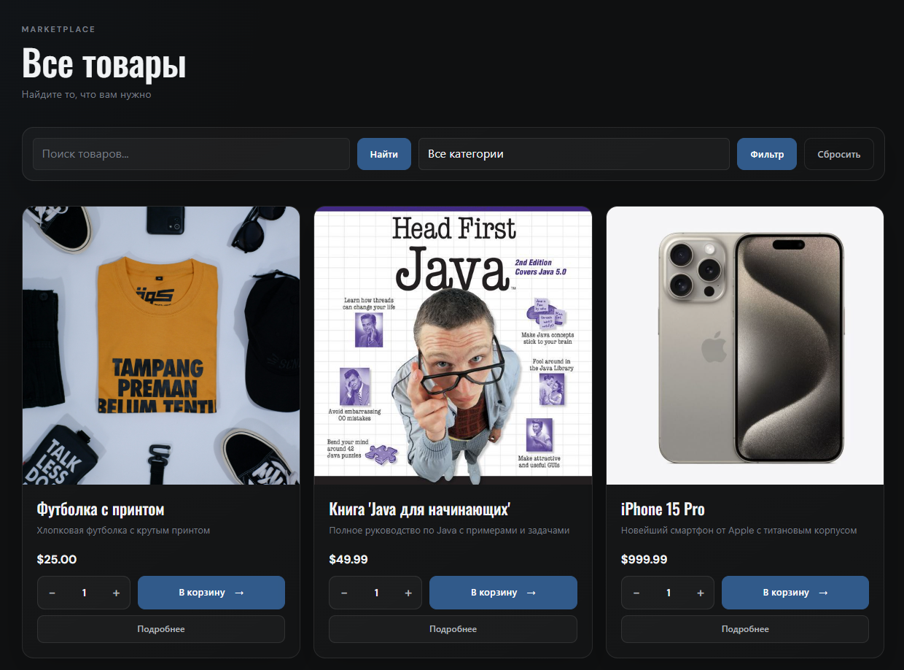

*Рис. 9. Общий вид витрины товаров с карточками и выбором количества*

### 4.3 Поиск

Поиск работает по **названию товара** — достаточно ввести любое слово, и витрина отфильтрует подходящие позиции.

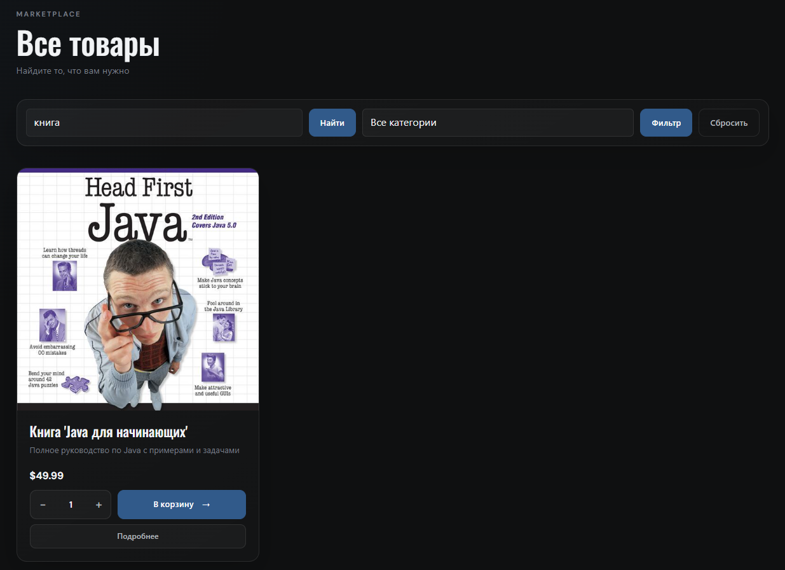

*Рис. 10. Результат поиска по названию*

Если поле поиска оставить пустым и отправить запрос — сработает сброс, и снова отобразятся все товары.

### 4.4 Фильтрация по категориям

Категории выбираются из **выпадающего списка**. После выбора витрина показывает только товары выбранной категории.

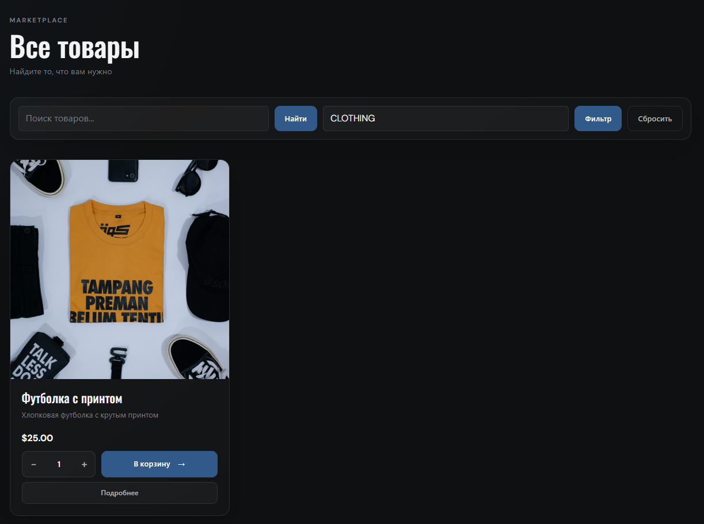

*Рис. 11. Фильтрация товаров по категории*

### 4.5 Сброс фильтров

Кнопка **«Сбросить»** возвращает витрину в исходное состояние — все товары, без поиска и фильтров.

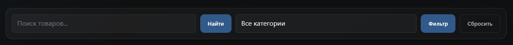

*Рис. 12. Кнопка сброса фильтров*

---

## 5. Карточка товара

Детальная страница товара открывается по кнопке **«Подробнее»** на витрине или на главной. Здесь можно рассмотреть товар поближе и добавить его в корзину.

Слева — крупное изображение, справа — информация о товаре:

- название
- категория
- цена
- краткое описание
- остаток в наличии

Прямо на странице можно выбрать количество с помощью счётчика **«− / +»** и нажать **«Добавить в корзину»**. Внизу — ссылка **«Назад к товарам»** для возврата на витрину.

*Рис. 13. Детальная страница товара*

После добавления товара происходит **редирект в корзину**, а сверху появляется уведомление об успешном добавлении.

---

## 6. Корзина

Корзина хранится в сессии. Если пользователь **не авторизован**, то при закрытии сессии корзина очищается. А вот для **авторизованных** пользователей корзина сохраняется в аккаунте — можно вернуться к покупкам позже.

### 6.1 Пустая корзина

Если в корзине нет товаров, отображается заглушка с иконкой, текстом **«Ваша корзина пуста»** и подсказкой добавить товары. Кнопка **«Перейти к товарам»** ведёт на витрину.

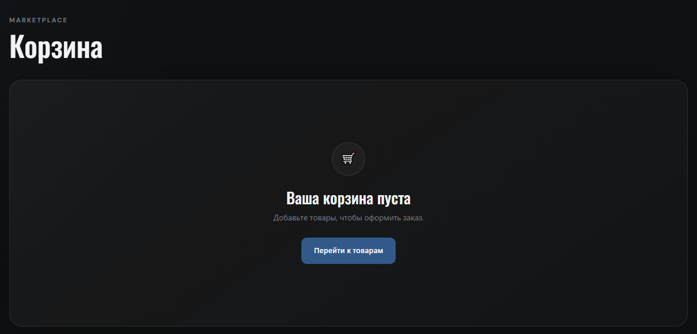

*Рис. 14. Пустая корзина*

### 6.2 Корзина с товарами

Товары выводятся в виде таблицы со столбцами:

- **Товар** — название позиции
- **Цена** — стоимость за единицу
- **Количество** — счётчик «− / +» для изменения прямо в корзине
- **Сумма** — итог по позиции
- **Действие** — кнопка **«Удалить»**

Внизу таблицы — строка **«Итого»** с общей суммой и кнопкой **«Очистить»** для удаления всех товаров сразу.

Под таблицей — две кнопки: **«Продолжить покупки»** (возврат на витрину) и **«Оформить заказ»** (переход к оформлению).

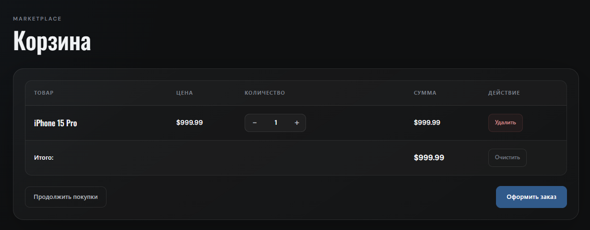

*Рис. 15. Корзина с товарами*

### 6.3 Уведомление о добавлении

После добавления товара пользователь попадает в корзину, а сверху появляется уведомление **«Товар добавлен в корзину»**.

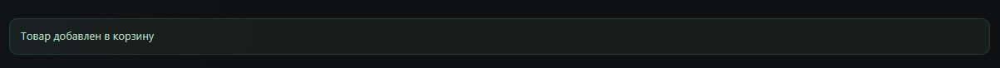

*Рис. 16. Уведомление об успешном добавлении товара*

---

## 7. Оформление заказа

После нажатия **«Оформить заказ»** в корзине открывается страница оформления. Нужно заполнить данные доставки:

- **Адрес доставки** — обязательное поле
- **Телефон** — обязательное поле
- **Комментарий** — необязательное поле

Ниже — сводка **«Ваш заказ»** со списком товаров, количеством и итоговой суммой.

Подтверждение — кнопкой **«Подтвердить заказ»**. Если передумал, есть ссылка **«Вернуться в корзину»**.

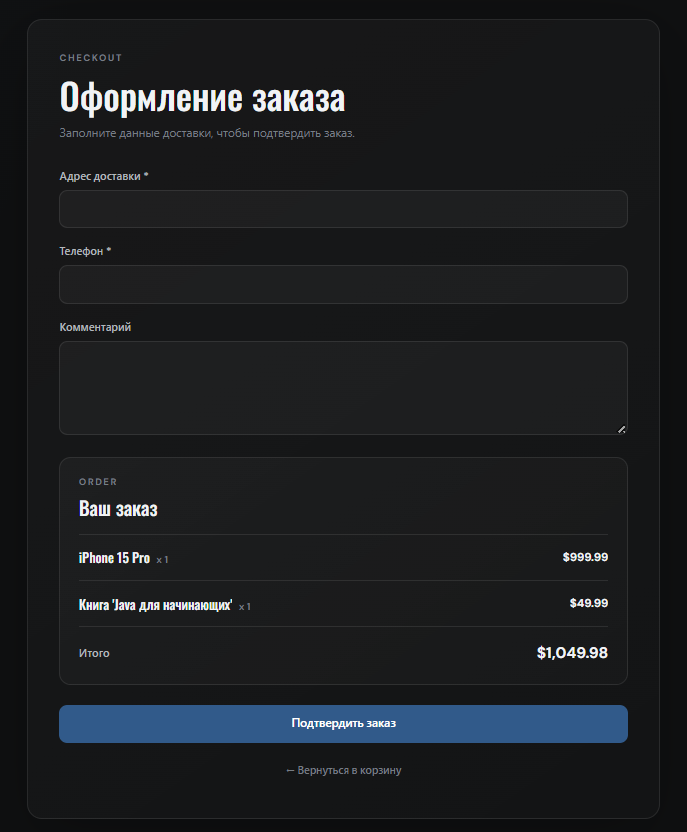

*Рис. 17. Страница оформления заказа*

### 7.1 Подтверждение заказа

После успешного оформления показывается страница с благодарностью и **номером заказа**. Отсюда можно перейти в **«Мои заказы»** или **«Продолжить покупки»**.

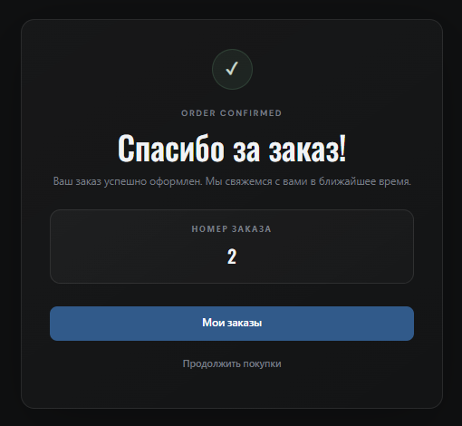

*Рис. 18. Страница подтверждения заказа*

---

## 8. История заказов

Все оформленные заказы доступны в разделе **«Мои заказы»** — он появляется в шапке после входа в аккаунт.

Каждый заказ отображается в таблице со столбцами:

- **№** — номер заказа
- **Дата** — когда заказ был оформлен
- **Статус** — текущее состояние (например, `CREATED`)
- **Сумма** — итоговая стоимость

Внизу — кнопка **«Продолжить покупки»** для возврата на витрину.

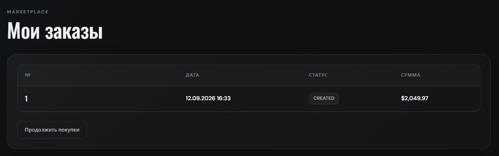

*Рис. 19. История заказов пользователя*

---

## 9. Страницы ошибок

Для обработки ошибок реализованы кастомные страницы — вместо стандартных сообщений Spring Boot пользователь видит аккуратно оформленные экраны.

### 9.1 Ошибка 404

Если страница не найдена, отображается кастомная заглушка с сообщением об ошибке и кнопкой возврата на главную.

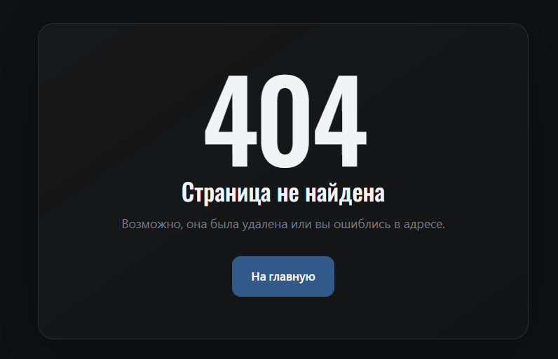

*Рис. 20. Страница ошибки 404*

### 9.2 Ошибка 500

Страница ошибки 500 оформлена в том же стиле — на случай внутренних сбоев сервера.

---
